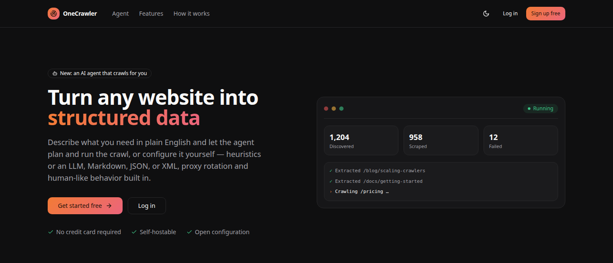

# OneCrawler UI

[](https://react.dev)
[](https://www.typescriptlang.org)
[](https://vitejs.dev)
[](https://tailwindcss.com)
[](https://github.com/pmndrs/zustand)
[](https://www.docker.com)



A dashboard for running and monitoring [onecrawler](https://github.com/sayedshaun/onecrawler) crawls: sitemap discovery, browser-backed link extraction, heuristic/GenAI scraping, composable content filters, proxies, and browser behavior — all as one shared `Settings` object, mirroring the Python library. A conversational AI agent can also plan and run crawls for you from a plain-English instruction.

The UI talks to a real FastAPI backend — [`onecrawler-backend`](https://github.com/sayedshaun/onecrawler-backend), a sibling project — over a REST API, with the crawl detail page polling for live progress, throughput, and results as a job runs.

## What's here

- **Landing page** — public marketing page at `/`.
- **Auth** — email/password login and signup, JWT-based, persisted in `localStorage`.
- **Dashboard** — aggregate stats (crawls, pages scraped, success rate, active jobs) and a recent-crawls table.
- **Agent** — a chat interface where you describe a crawl in plain English; the agent plans it, runs it, and reports back, streaming tool-call trace steps live as it works.
- **New Crawl** — pick a discovery mode (sitemap / link extraction / full crawler / direct scraper), then configure discovery limits & patterns, scraping strategy (heuristic or GenAI with a schema builder), content filters (`by_date` / `by_keywords` / `by_files` / `by_extension` / `by_cosine_similarity`, composable with AND/OR), proxies, and browser/human-behavior settings. A collapsible "Settings Payload" panel previews the exact JSON sent to the backend.
- **Crawl Detail** — live progress bar, throughput chart, discovered-URL stream, results table with a content preview drawer, and a terminal-style log console.
- **Crawl History** — searchable, filterable list of all jobs.
- **Extracted Data** — a global, cross-crawl browser for every scraped result, filterable by format, with the same content preview drawer.
- **Templates** — save a full crawl configuration (discovery, scraping strategy, filters, proxies, browser behavior) as a named, reusable template, and launch new crawls from it instantly.
- **Settings** — default `Settings` values applied to every new crawl, persisted to `localStorage`.
- **Tutorial** — in-app guided onboarding (accessible from the account menu) covering core concepts and your first crawl.

## Requirements

- **Node.js 20+** and npm, **or** Docker.
- A running [`onecrawler-backend`](https://github.com/sayedshaun/onecrawler-backend) instance (FastAPI + Postgres + Redis + an arq worker) — this UI has no functionality of its own without it.

## Getting started

### With Docker (recommended)

```bash
docker compose -f docker-compose.dev.yml up
```

This builds the `dev` stage of the `Dockerfile` and starts a hot-reloading Vite dev server on `http://localhost:5173`, with `/api` proxied per `API_PROXY_TARGET` in `.env` (defaults to `http://host.docker.internal:8000`, i.e. a backend running on your host machine).

For a production-like preview instead — a static build served by Caddy, with `/api` reverse-proxied the same way — use `docker compose up` (no `-f`) instead, which serves on `http://localhost:8080`.

### With Node directly

```bash
npm install
npm run dev
```

Then open the printed local URL (default `http://localhost:5173`). Point `vite.config.ts`'s dev proxy (or `API_PROXY_TARGET`) at wherever `onecrawler-backend` is running.

Other scripts:

```bash
npm run build     # type-check + production build to dist/
npm run preview   # preview the production build locally
npm run lint      # eslint
```

## Self-hosting

`docker compose up` (no `-f`) builds the `prod` stage of the `Dockerfile` — a static Vite build served by [Caddy](https://caddyserver.com) — and publishes it on `http://localhost:8080`. That's the image to deploy if you're self-hosting.

- **Point it at your backend** — copy `.env.example` to `.env` and set `API_PROXY_TARGET` to your `onecrawler-backend` origin. The `Caddyfile` reads this at *container start* (not build time), so the same built image can be repointed at a different backend just by editing `.env` and restarting the container — no rebuild needed.
- **Only `/api/*` is proxied** — the `Caddyfile` reverse-proxies `/api/*` to `API_PROXY_TARGET` and falls through everything else to `index.html` (so client-side routing works); it serves plain HTTP on `:80` internally.
- **TLS is on you** — for a public deployment, put this behind a reverse proxy/load balancer that terminates TLS (or edit the `Caddyfile` to use Caddy's automatic HTTPS with a real domain instead of `:80`).
- **This repo is UI-only** — self-hosting it still requires a reachable `onecrawler-backend` instance (FastAPI + Postgres + Redis + an arq worker), running separately, either on the same host (`http://host.docker.internal:8000`) or wherever you deploy it.
- **No server-side session state** — auth is JWT-based and persisted in the browser's `localStorage`, so there's nothing extra to provision for auth beyond the backend itself.

## Project structure

```
src/
  components/
    ui/            shadcn-style primitives (button, card, dialog, select, ...)
    layout/        app shell, sidebar, top bar, theme toggle
    auth/          shared login/signup layout
    routing/       route guards (ProtectedRoute)
    crawl-form/    New Crawl / Settings page form sections
    crawl-detail/  live progress, logs, results, discovered URLs
    dashboard/     dashboard-only widgets
    agents/        agent chat UI — messages, composer, trace steps, conversation history
    templates/     crawl template cards and pickers
    settings/      account/settings page pieces
    tutorial/      in-app guided onboarding
    shared/        cross-page widgets (status badge, crawls table, result drawer, empty state, pagination)
  pages/           one file per route
  hooks/           use-polled-resource, use-debounced-value, use-media-query
  store/           zustand stores (auth session, persisted crawl-form defaults)
  lib/
    types.ts         CrawlSettings etc. — mirrors onecrawler's Python Settings shape
    api.ts           apiFetch — the shared authenticated fetch wrapper
    crawls-api.ts    crawl/data/discovered-URL/log endpoints
    agents-api.ts    agent chat streaming + conversation endpoints
    templates-api.ts crawl template CRUD endpoints
    settings-api.ts  account/settings endpoints
    api-mapper.ts    converts UI state to the backend's snake_case payload
  providers/       theme provider (light/dark/system)
```

## Backend contract

`src/lib/api-mapper.ts` shapes crawl settings into the snake_case payload matching onecrawler's `Settings` kwargs (`link_extraction_limit`, `proxy_rotation_method`, `scraping_output_format`, etc.) — that's the contract `onecrawler-backend` accepts. `src/lib/crawls-api.ts` is the full list of REST endpoints this UI calls (crawls, discovered URLs, logs, extracted data, cancel/retry/delete).
